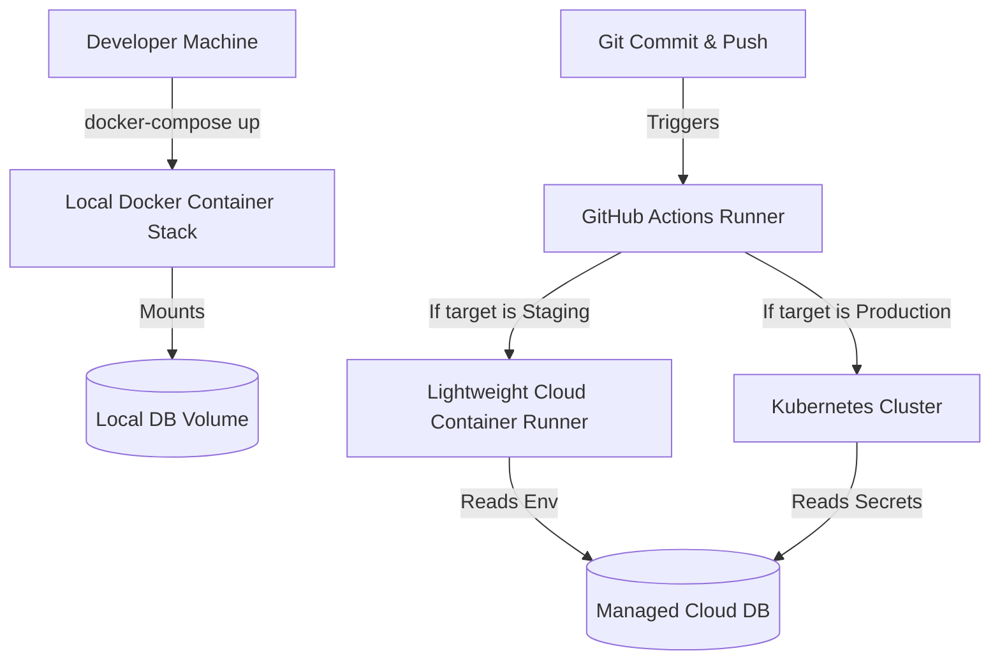

# Deployment Architecture & Product Roadmap Plan

This plan outlines the containerization strategy, conditional deployments (Varying by environment), database setup strategies (local vs. cloud), and key product features missing from the SMMA-Final-Build codebase.

---

## 1. Environment-Based Deployment Architecture

We will implement a hybrid infrastructure strategy, allowing simple local orchestration and deployment to a robust production infrastructure.



### A. Local Development Environment (Docker Compose)
*   Developers run the system locally using a single `docker-compose.yml` file.
*   The stack spins up the Next.js frontend, Node.js Express API backend, and a local PostgreSQL container.
*   **Persistent Storage:** The PostgreSQL container mounts to a local Docker volume (`postgres_local_data`) so database state persists across runs.

### B. Staging / Testing Environment (Container-as-a-Service)
*   **Trigger Condition:** Merges/Pushes to a development or testing branch.
*   **Infrastructure:** Light container hosts (e.g., AWS ECS Fargate, Render, or Google Cloud Run) deployed dynamically.
*   **Database:** Connects directly to a cloud testing database (no local database container is deployed).

### C. Production Environment (Kubernetes Cluster)
*   **Trigger Condition:** Merges/Pushes to the `main` branch.
*   **Infrastructure:** Standard Kubernetes cluster.
*   **Decoupled Scaling:** Services scale independently using Deployments, ClusterIP Services, and Ingress routing. 
*   **Autoscaling (Optional):** Using KEDA (Kubernetes Event-driven Autoscaling) to scale async worker pods to 0 when queue backlogs are empty.

---

## 2. Database Integration Strategy

Your code stays stateless by routing connections dynamically using standard environment variables: `DATABASE_URL`.

### A. Local Configuration
Prisma reads the database URL locally from `/backend/.env` or Docker Compose variables:
```env
DATABASE_URL=postgresql://postgres:postgres@db:5432/orean360
```
This points to the PostgreSQL container running inside your local network.

### B. Production Configuration (GitHub Actions Integration)
When deploying, the local database container is not run. Instead, the backend connects directly to a managed Postgres database (e.g. Supabase, AWS RDS, Neon, or Google Cloud SQL) using credentials injected securely via secrets.

1.  **Configure GitHub Secrets:** 
    *   Store your database connection string as a repository secret: `DATABASE_URL`.
2.  **Define Pipeline Job Steps:**
    *   Run migrations before updating container builds.
    *   Inject secrets into build and deploy environments dynamically:
    ```yaml
    # Example Workflow Steps
    - name: Run Prisma Database Migrations
      run: npx prisma migrate deploy
      working-directory: ./backend
      env:
        DATABASE_URL: ${{ secrets.DATABASE_URL }}
    ```

---

## 3. Product Feature Gaps

To make this social media scheduling application production-ready, the following core features should be scheduled for development:

### 1. Active Task & Event Queues (BullMQ + Redis)
*   **Problem:** Storing scheduled post timers in node memory is unreliable; if the server restarts, pending schedules are lost.
*   **Solution:** Implement persistent queues using Redis and BullMQ. Background workers will periodically pick up tasks, publish posts, and track job failures.

### 2. Rate-Limiting & Buffering
*   **Problem:** Directly calling social media APIs concurrently leads to rate-limiting blocks or bans.
*   **Solution:** Implement throttling buffers within the queue workers to space posts out according to API limits.

### 3. Media Transcoding Service (FFmpeg)
*   **Problem:** Instagram, TikTok, and YouTube require specific codecs, file dimensions, file sizes, and aspect ratios.
*   **Solution:** Add a background microservice that transcodes uploaded media assets into optimized streaming profiles and generates visual thumbnails.

### 4. OAuth Refresh Token Monitors
*   **Problem:** Connected social network authentication tokens expire periodically.
*   **Solution:** Track token parameters in PostgreSQL, monitor token expiry dates, and alert users via dashboard notifications or emails to re-authenticate before scheduled content fails.

### 5. Detailed Execution Auditing
*   **Problem:** Users must know exactly why a post failed (e.g., copyright violation, text too long, API outage).
*   **Solution:** Store response payloads returned by social APIs in a `PublishLog` audit table and present clear error messages on the customer dashboard.
