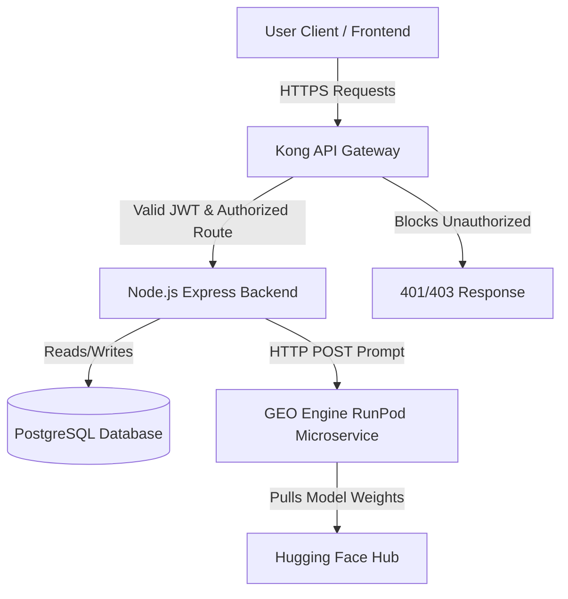

# Master Architecture & Product Plan: SMMA-Final-Build

This master document consolidates the complete architectural strategy, deployment workflow, product roadmap, API security model, and microservice integrations for the SMMA-Final-Build application.

---

## 1. Complete System Architecture

We are utilizing a microservice-oriented architecture with a hybrid API Gateway pattern, separating edge routing from core business logic.

---

## 2. API Security & Access Control (Hybrid Approach)

To ensure maximum security and performance, we implement a **Hybrid Security Model** utilizing Kong API Gateway in tandem with backend application logic.

### A. Kong API Gateway (Coarse-Grained & Edge Security)
Kong acts as the gatekeeper at the edge of the network.
*   **Authentication:** Validates incoming JWTs (checks signature and expiration). Drops invalid requests before they reach the backend, saving CPU cycles.
*   **Coarse-Grained RBAC:** Enforces path-based access control by reading JWT claims (e.g., blocking non-admins from `/api/v1/admin/*`).
*   **Global Security:** Handles API Rate Limiting, DDoS protection, CORS headers, and SSL termination.

### B. Node.js Backend (Fine-Grained ABAC & Business Logic)
The backend assumes incoming requests are authenticated and authorized for the specific route, allowing developers to focus purely on business logic.
*   **Resource Ownership:** Handles Attribute-Based Access Control (ABAC). Checks if the user actually owns the data they are requesting (e.g., `document.ownerId === user.id`).
*   **Contextual Logic:** Manages multi-tenant checks, subscription tier limits, and issues the JWT containing the user's role upon login.
*   **UI State:** Passes the user's role back to the frontend so the UI can conditionally render components (like Admin sidebars).

---

## 3. Environment-Based Deployment Architecture

We utilize a varying infrastructure strategy based on the deployment target, keeping the application stateless and relying on environment variables (`DATABASE_URL`).

### A. Local Development (Docker Compose)
*   **Setup:** A single `docker-compose.yml` spins up the Next.js frontend, Node backend, Kong Gateway, and local PostgreSQL container.
*   **Storage:** The database uses a local Docker volume (`postgres_local_data`) for persistence across boots. Database spins up automatically alongside the app.

### B. Staging & Production (Kubernetes / Cloud Container Runners)
*   **CI/CD Pipeline (GitHub Actions):** Triggered by pushes to specific branches.
*   **Job Flow:** Checkout codebase -> Set Node/NPM -> Run Prisma Migrations (`npx prisma migrate deploy`) -> Build Docker Images -> Deploy to Cloud.
*   **Database Integration:** Cloud environments **do not** run the local Postgres container. Instead, they connect to a permanently active managed database provider (e.g., Supabase, AWS RDS) using credentials injected securely via GitHub Secrets.

---

## 4. GEO Content Generation Microservice

The GEO content engine runs as a standalone, serverless microservice to avoid bogging down the main backend with heavy LLM inference tasks.

### A. Model Hosting & Inference Setup
1.  **Hugging Face:** Host your fine-tuned `model-q4_k_m.gguf` in a private repository.
2.  **RunPod Serverless GPU:** Create an endpoint running a vLLM/Ollama container that points to your Hugging Face repository. RunPod provides a REST API URL that scales down to zero when idle, minimizing costs.

### B. Backend Integration Flow
1.  **Seamless UI:** Users click "Generate Post" in the web app. No redirects occur. A loading state is shown.
2.  **API Call:** The Node.js backend constructs the prompt and makes a secure HTTP POST to the RunPod Endpoint using the RunPod API Key.
3.  **Database Persistence:** Once RunPod returns the generated text, the backend parses it (Caption, Hashtags, Alt-Text), saves a new record to the PostgreSQL database linked to the user, and returns the data to the frontend for display.

---

## 5. UI/UX & Codebase Optimization Recommendations

> [!IMPORTANT]
> To ensure long-term maintainability and performance, the following structural refactoring should occur on the existing frontend codebase.

### A. Consolidate Duplicate Component Libraries
*   Move shared components (e.g., `InstagramPreview`, `FacebookPreview`, `LoadingScreen`) currently duplicated in `/frontend` and `/orean-web` into a common workspace package (e.g., `/packages/shared-ui`). This ensures visual consistency.

### B. Parameterize Environment Variables
*   Replace hardcoded fetch URLs (`http://localhost:8080`) with environment variables (`process.env.NEXT_PUBLIC_API_URL`) to allow seamless deployment across environments.

### C. Connect Static Mockups to Real State
*   Replace `setTimeout` simulated loading states in the Dashboard and Approvals list with real TanStack Query data fetching connected to the Postgres/Prisma backend.

---

## 6. Product Roadmap: Finishing the Workspaces

The following technical strategies will transition the current under-construction placeholder pages into functional features:

*   **Workflows (`/dashboard/workflows`):** Integrate a visual canvas node builder like **React Flow** to let users build drag-and-drop social approval pipelines.
*   **Assets (`/dashboard/assets`):** Connect the UI to an active storage service (AWS S3/Cloudinary) supporting multi-file drag-and-drop and metadata tagging.
*   **Campaigns (`/dashboard/campaigns`):** Implement relational DB schemas linking multiple posts/assets into unified marketing drives, with aggregated reach metrics.
*   **Approvals (`/dashboard/approvals`):** Build a split-screen view showing the post preview alongside a live comments thread using WebSockets for real-time collaboration.
*   **Analytics (`/dashboard/analytics`):** Integrate **Recharts** for visualizing brand health metrics (follower growth, engagement rates) with date-range filters.
*   **GEO Engine Analytics (`/dashboard/geo-engine`):** Run background algorithms to score generated text on Citation Probability, Semantic Density, and Readability, displaying the results in visual gauge charts.

---

## 7. Core Feature Gaps (To-Do List)

To make the platform truly production-ready, the following robust backend features are required:

- [ ] **Active Task Queues (BullMQ + Redis):** Replace in-memory scheduled timers with persistent Redis queues to ensure scheduled posts are not lost during server restarts.
- [ ] **Rate-Limiting & Buffering:** Implement throttling within queue workers to respect social media API rate limits.
- [ ] **Media Transcoding Service:** Add an FFmpeg background microservice to format video uploads into platform-specific codecs, dimensions, and sizes (TikTok, IG Reels, YouTube).
- [ ] **OAuth Refresh Monitors:** Track social token expiration dates in PostgreSQL and alert users to re-authenticate before tokens expire.
- [ ] **Execution Auditing:** Store all API response payloads in a `PublishLog` table so users can see exact error reasons if a post fails (e.g., copyright strike, text too long).
