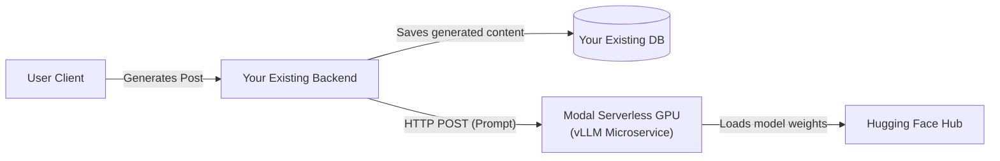

# GEO Content Generation Microservice Plan

Since you are integrating this into an existing web application, the GEO content generator will act as a standalone, serverless **Microservice**. Your existing web app's backend will query this microservice to generate content and then handle saving the results directly to your existing database.

## Architecture Overview



## Step 1: Host the Model Weights (Hugging Face)
Before the cloud GPU can run your model, it needs to download it securely. Since we are using **vLLM** for serving, we will use the standard merged `.safetensors` model format (not GGUF).
1. Create a free account on [Hugging Face](https://huggingface.co/).
2. Create a new **Private** model repository (e.g., `Vi-ViD/GEO-Engine`).
3. Upload the merged 16-bit `.safetensors` model files directly from Google Colab to this repository.

## Step 2: Set Up the Serverless Inference API (Modal vLLM)
**Modal** is highly recommended for serverless deployments. It provides a standard REST API endpoint that scales down to zero when not in use, and comes with a **free starter tier of $30/month** (meaning it will likely cost you $0).

1. Create a free account on [Modal.com](https://modal.com/) (log in with your GitHub account).
2. Install the Modal CLI on your computer and authenticate:
   ```bash
   pip install modal
   modal setup
   ```
3. Set up your private Hugging Face Read token as a **Modal Secret** named `huggingface-secret` in your Modal dashboard, containing:
   * Key: `HF_TOKEN` / Value: `[Your HF Read Token]`
4. Create a file named `serve.py` in your project containing the deployment script:
   ```python
   import modal

   # Define the environment with PyTorch and vLLM
   vllm_image = (
       modal.Image.debian_slim(python_version="3.12")
       .pip_install("vllm", "huggingface_hub")
   )

   app = modal.App("geo-engine-service")

   @app.function(
       image=vllm_image,
       gpu="A10G",  # A10G is cost-effective and perfect for 7B 4-bit models
       secrets=[modal.Secret.from_name("huggingface-secret")],
       scaledown_window=120,  # Scale down to 0 after 2 minutes of idle time
   )
   @modal.web_server(port=8000)
   def serve():
       import subprocess
       cmd = [
           "vllm", "serve", "Vi-ViD/GEO-Engine",
           "--host", "0.0.0.0",
           "--port", "8000"
       ]
       subprocess.run(cmd)
   ```
5. Deploy the microservice to Modal:
   ```bash
   modal deploy serve.py
   ```
6. Once deployed, Modal gives you a public **Endpoint URL** (e.g., `https://your-username--geo-engine-service-serve.modal.run`).

## Step 3: Integrating the Microservice into Your Existing Web App

You don't need to build a new frontend. You just need to write a function in your existing backend that talks to the Modal microservice.

### Seamless UI Integration (No Redirects)
**Crucially, your users will never leave your web app or be redirected to another website.** You will build your own native User Interface (e.g., a "Generate Post" button) inside your existing app. When the user clicks this button, your frontend simply displays a loading spinner while your backend secretly talks to Modal behind the scenes.

### 1. Constructing the Payload
When a user wants to generate a post, your backend takes their inputs (Platform, Topic, Target Audience, Goal) and injects them into the system prompt template we used during fine-tuning.

### 2. Making the API Call
Your backend makes an HTTP `POST` request to the Modal Endpoint URL.
*   **Headers:** Include `Authorization: Bearer YOUR_API_KEY` (if you set up API key protection in Modal).
*   **Body:** A JSON payload containing the formatted prompt, `temperature` (e.g., 0.7), and `max_tokens` (e.g., 512).

### 3. Database Persistence
When the microservice returns the generated text:
1. Your backend parses the output to separate the Caption, Hashtags, Alt-Text, and Meta Description.
2. Insert a new record into your existing database linking this content to the user who requested it.
3. Return the saved data to your frontend so the user can see it.

## Cost Estimation
- **Model Storage (Hugging Face):** $0 / month (Private repository)
- **Microservice Infrastructure (Modal):** $0 / month (Assuming usage fits within Modal's recurring $30/month free credits. Scaling to zero ensures no charges run up while idle).

---

> [!NOTE]
> **User Review Required**
> Since this replaces the standalone web app concept, please review this microservice approach. If this looks good to you, the plan is finalized and we can wrap up!
